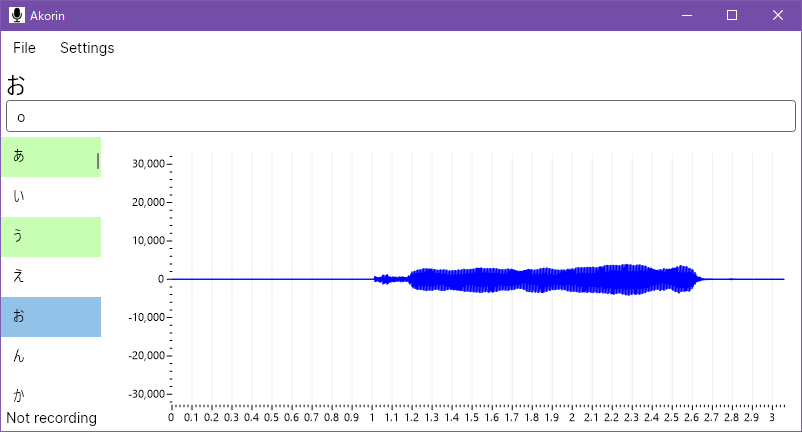
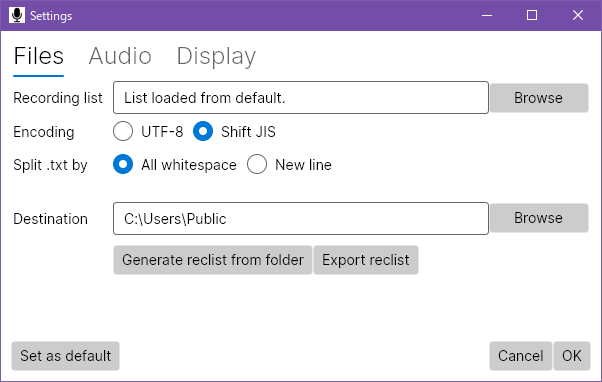

# Akorin
The OREMO killer: A line-by-line audio recording tool for singing synthesis libraries



Download latest version from [Releases](https://github.com/adlez27/akorin/releases).

## Features
* Load several reclist formats, including a custom format that combines the reclist with notes
* Load Shift JIS and UTF-8 reclists
* Split plain text lists by all whitespace or by newline
* Set a destination folder for auto-saved recordings
* Record from any input or output, and play back through any output
* Set input/output levels
* Customize font size of selected line
* Display waveform and customize color of waveform
* Highlight lines that have already been recorded
* Save ARP (Akorin Recording Project) files
* Set your own default project settings for all new projects

## Installation
**Windows:** Unzip and place the folder anywhere. Run `Akorin.exe` to start Akorin.  
**Mac:** (Current app bundle is bugged. Releases will return when this is resolved, but mac users will have to build from source in the meantime.)  
**Linux:** There is no intention to provide a convenient release to Linux users, who should be capable of building from source.

## Usage
### Recording
The currently selected line and its note are displayed at the top of the window. You can edit the note to add things like pronunciation guides, and it will autosave with your project.  
Press `R` once to start recording, and press `R` again to stop recording. The waveform will appear after recording is stopped.  
Press `space` once to start playback, and press `space` again to stop playing.  
Click on items in the list or use arrow keys to navigate through the list. Audio is automatically saved to your specified folder when moving through the list. Lines that are already recorded will be highlighted. When you open a project, it'll automatically jump to the last line you selected.

### Changing reclist and folder
Go to Settings > List and folder.



The currently supported formats are:
- Akorin recording list (.arl)
- `OREMO-comment.txt`
- `index.csv` for ARPAsing and [oto generator](https://github.com/adlez27/oto-generator)
- [WavConfigTool](https://github.com/HeidenBZR/WavConfigTool) reclist (.reclist)
- Plain text reclist (.txt) (Can split lines by all whitespace or by new line only)
- UTAU sequence text (.ust)
- Create reclist from files in folder
When you load or create a reclist, you can export it as an ARL to use again later. The exported ARL will include all of the notes you've added to the current project.

### Writing an Akorin Recording List
Akorin Recording Lists use YAML, which is very simple to read and write. Create a plain text file using a text editor like Notepad or TextEdit, with the following formatting.
```yaml
line 1: note 1
line 2: note 2
line 3: note 3
```
Save the file with the extension `.arl`. You can refer to the reclists included in the releases for examples of a full reclist. If Akorin has trouble reading the reclist, try surrounding the line or note with double quotes ``"like this"``.

## Other
Suggest new features and submit bug reports in [Issues](https://github.com/adlez27/akorin/issues).  
You can view current plans and progress in [Projects](https://github.com/adlez27/akorin/projects).  
Chat with other devs and users on [Discord](https://discord.gg/qZEPyhSqmf).

---
"File:Font Awesome 5 solid microphone-alt.svg" by Font Awesome is licensed with CC BY 4.0. To view a copy of this license, visit https://creativecommons.org/licenses/by/4.0
